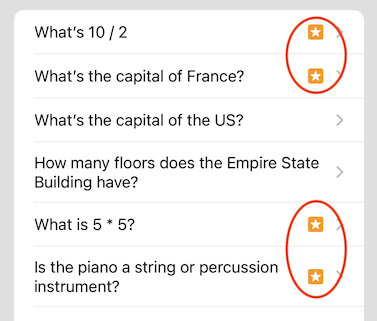

# Memre API Learning App

Example iOS app written using SwiftUI. Demonstrates a learning app that uses the Memre Learning Engine API to enhance the learning experience by recommending what to study.

[Memre Learning Engine API Documentation](https://rapidapi.com/memre-memre-default/api/learning-engine/)

Example calls to the Memre Learning Engine api can be found in [MemreLearningEngine.swift](LearningApp/api/MemreLearningEngine.swift).

## Learning Engine Integration Guide:

1. Obtain a RapidAPI key: [RapidAPI sign-up](https://rapidapi.com/auth/sign-up?referral=/memre-memre-default/api/learning-engine/pricing)

2. Use the RapidAPI key to make api calls to the Memre Learning Engine

https://github.com/ceregousa/ios_memre_api_app/blob/ee024191b38672b6ea703b9d6927727065b1847a/LearningApp/MyUserDefaults.swift#L6-L9

[MemreLearningEngine.swift](LearningApp/api/MemreLearningEngine.swift)
```swift
private static func makeApiRequest(apiPath: String,
                                   httpMethod: String) -> URLRequest? {
    guard let url = URL(string: baseUrl + apiPath) else { return nil }
    guard let apiKey = MyUserDefaults.getApiKey() else { return nil }
    return makeUrlRequest(url: url, httpMethod: httpMethod, apiKey: apiKey)
}

private static func makeUrlRequest(url: URL,
                                   httpMethod: String,
                                   apiKey: String) -> URLRequest {
    var result = URLRequest(url: url)
    result.httpMethod = httpMethod
    result.addValue(apiKey, forHTTPHeaderField: "X-RapidAPI-Key")
    result.addValue(host, forHTTPHeaderField: "X-RapidAPI-Host")
    return result
}
```

3. Create a Learning Engine User and store the user id to use with subsequent api calls for the user of the learning app.

[EnterAPIKeyView.swift](LearningApp/screens/EnterAPIKeyView.swift)
```swift
MemreLearningEngine.createUser(apiKeyTextEntry,
                               onCompletion: {
    isShowingStudyItemsView = true
},
                               onError: { errorMessage in
    alertMessage = errorMessage
    showingAlert = true
})
```

[MemreLearningEngine.swift](LearningApp/api/MemreLearningEngine.swift)
```swift
static func createUser(_ apiKey: String,
                       onCompletion: @escaping () -> Void,
                       onError: @escaping (String) -> Void) {
    guard let request = makeApiRequest(apiKey: apiKey, apiPath: "users", httpMethod: "POST") else {
        onError("Unepected failure creating request")
        return
    }

    let task = URLSession.shared.dataTask(with: request,
                                          completionHandler: {
        data, response, error -> Void in
        if let json = parseApiResponse(data: data,
                                       response: response,
                                       error: error,
                                       onError: onError) {
            guard let userJson = json["data"] as? [String: Any] else {
                onError("Unexpected missing data")
                return
            }
            guard let userId = userJson["id"] as? String else {
                onError("Unexpected missing id")
                return
            }
            MyUserDefaults.setApiKey(apiKey)
            MyUserDefaults.setUserId(userId)
            onCompletion()
        }
    })
    task.resume()
}
```

4. Create a Learning Engine Item and associate the item id to each study item in the app.

[MemreLearningEngine.swift](LearningApp/api/MemreLearningEngine.swift)
```swift
static func createLearningItem(onCompletion: @escaping (String) -> Void,
                               onError: @escaping (String) -> Void) {
    guard let apiKey = MyUserDefaults.getApiKey() else {
        onError("Unepected missing api key")
        return
    }
    guard let request = makeApiRequest(apiKey: apiKey, apiPath: "items", httpMethod: "POST") else {
        onError("Unepected failure creating request")
        return
    }

    let task = URLSession.shared.dataTask(with: request,
                                          completionHandler: {
        data, response, error -> Void in
        if let json = parseApiResponse(data: data,
                                       response: response,
                                       error: error,
                                       onError: onError) {
            guard let itemJson = json["data"] as? [String: Any] else {
                onError("Unexpected missing data")
                return
            }
            guard let itemId = itemJson["id"] as? String else {
                onError("Unexpected missing id")
                return
            }
            onCompletion(itemId)
        }
    })
    task.resume()
}
```

[AddStudyItemView.swift](LearningApp/screens/AddStudyItemView.swift)
```swift
private func createNewStudyItem() {
    loading = true
    MemreLearningEngine.createLearningItem(onCompletion: { learningItemId in
        loading = false
        MyUserDefaults.addStudyItem(StudyItem(id: UUID().uuidString,
                                             learningEngineId: learningItemId,
                                             question: question,
                                             answer: answer,
                                              distractors: parseDistractors()))
        onCompletion()
        DispatchQueue.main.async {
            dismiss()
        }
    },
                                        onError: { errorMessage in
        loading = false
        alertMessage = errorMessage
        showingAlert = true
    })
}
```

5. Post a study report whenever the user studies a learning item.

[StudyQuizView.swift](LearningApp/screens/StudyQuizView.swift)

```swift
let now = Date()
let studyTime = now.timeIntervalSince(startDate) * 1000
let quizResult: QuizResult = (selectedAnswer == studyItem.answer) ? .Correct : .Incorrect
MemreLearningEngine.postStudyReport(itemId: studyItem.learningEngineId,
                                    quizResult: quizResult,
                                    studyTimeMillis: studyTime) {
    didSubmitAnswer = true
} onError: { errorMessage in
    alertMessage = errorMessage
    showingAlert = true
}
```

6. Use the Learning Engine recommendations to suggest which items to study.



[StudyItemsView.swift](LearningApp/screens/StudyItemsView.swift)
```swift
private func reloadRecommendedStudyItems() {
    MemreLearningEngine.getRecommendedStudyItems { studyItemIds in
        self.recommendedStudyItemIds = studyItemIds
    } onError: { errorMessage in
        showingAlert = true
        alertMessage = errorMessage
    }
}
    
private func isRecommended(_ studyItem: StudyItem) -> Bool {
    return self.recommendedStudyItemIds.contains(studyItem.learningEngineId)
}
```

[StudyItemCell.swift](LearningApp/view/StudyItemCell.swift)
```swift
if (isRecommended) {
    Spacer()
    Image(systemName: "star.square.fill")
        .scaledToFill()
        .foregroundColor(.orange)
        .frame(width: 20, height: 20)
}
```